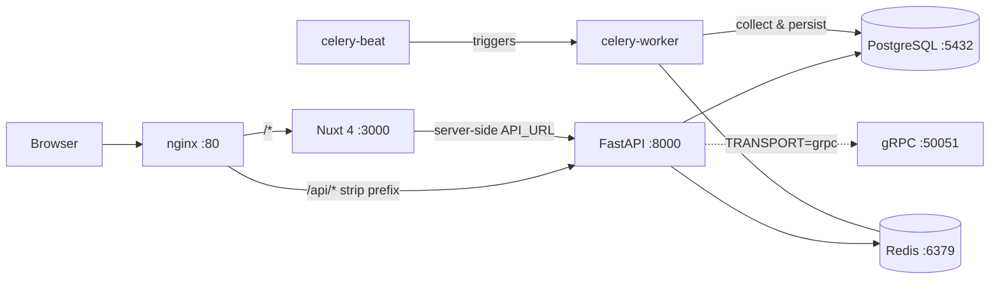

# Crisis Dashboard

A macroeconomic crisis monitoring dashboard that aggregates 17+ financial data collectors, news feeds, hedge fund filings, and AI analysis to track US recession risk in real time. The Ukrainian-language frontend displays a composite crisis score (0–100) and per-indicator breakdowns.

Live at **crisismeter.duckdns.org**.

## Stack

| Layer | Technology |
|---|---|
| Frontend | Nuxt 4, Vue 3, Tailwind CSS, Recharts, PWA |
| Backend | Python 3.12, FastAPI, Celery + Celery Beat |
| Storage | PostgreSQL 16 (asyncpg + SQLAlchemy async ORM), Redis 7 |
| AI | Anthropic Claude or LongCat API (configurable via `AI_PROVIDER`) |
| Transport | REST always on `:8000`; optional gRPC `:50051` when `TRANSPORT=grpc` |
| Infra | Docker Compose (local), nginx reverse proxy, systemd units (prod) |

## Architecture



## Data Sources

| Collector | What it fetches | Source | Celery schedule |
|---|---|---|---|
| `fred.py` | 24+ macro indicators (yield curve, unemployment, CPI, VIX, M2, …) | FRED API | Daily 16:00 UTC |
| `yahoo.py` | Real-time prices: S&P 500, VIX, WTI oil, DXY, BRK-B | yfinance | Every 30 min |
| `news.py` | Headlines from Reuters, FT, ZeroHedge, ISW, Bloomberg | RSS | Every 30 min |
| `finnhub.py` | US high/medium-impact economic calendar events + news | Finnhub API | Hourly :05 |
| `buffett.py` | Berkshire Hathaway 13F top-15 holdings | SEC EDGAR | Monday 10:00 UTC |
| `managers_13f.py` | 13F for Bridgewater/Dalio, Scion/Burry, Pershing/Ackman | SEC EDGAR | Monday 11:00 UTC |
| `eia.py` | US petroleum stocks — crude, gasoline, distillate (260 weeks) | EIA API | Wednesday 16:00 UTC |
| `fed_balance.py` | Fed H.4.1: total assets, reserves, Treasuries, MBS, repo, loans | FRED API | Thursday 21:30 UTC |
| `cpi.py` | CPI: all-items, energy, food, housing, transport, medical, gasoline | FRED API | 15th of month 14:00 UTC |
| `cot.py` | CFTC COT positions: crude oil, gold, S&P 500 futures, EUR/USD | CFTC zip files | Friday 21:00 UTC |
| `ai_analyst.py` | Structured macro analysis JSON via Claude or LongCat | Anthropic / LongCat | Daily 17:00 UTC |
| `fear_greed.py` | CNN Fear & Greed index | CNN | Hourly :00 |
| `index_comparison.py` | S&P 500 vs MSCI World returns (1M / 3M / YTD / 1Y) | yfinance | Every 30 min |
| `market_signals.py` | 5-signal entry checker: VIX, Fear&Greed, SP500/MA200, CAPE, COT | yfinance + DB | Hourly :15 |
| `pmi_scraper.py` | Manufacturing + Services PMI (web scrape) | ISM website | Manual only (not scheduled) |
| `stock_fundamental.py` | On-demand per-ticker fundamentals + AI analysis | yfinance + AI | Per request |
| `youtube.py` | YouTube transcript extraction + critical analysis | youtube-transcript-api | Per request |

## Quick Start

### Required environment variables

Copy `.env.example` to `.env` and fill in:

```bash
FRED_API_KEY=          # Federal Reserve FRED API
ANTHROPIC_API_KEY=     # Anthropic (Claude) API
EIA_API_KEY=           # US Energy Information Administration
FINNHUB_API_KEY=       # Finnhub financial data
TRANSPORT=json         # json = REST only | grpc = REST + gRPC :50051

# Optional
AI_PROVIDER=anthropic          # anthropic | longcat
LONGCAT_API_KEY=               # required if AI_PROVIDER=longcat
ANTHROPIC_MODEL=claude-sonnet-4-20250514
```

`DATABASE_URL` and `REDIS_URL` are hardcoded in `docker-compose.yml` for local Docker use.

### Docker Compose

```bash
cp .env.example .env
# fill in API keys

TRANSPORT=json docker compose up --build   # REST only; Swagger at localhost:8000/docs
TRANSPORT=grpc docker compose up --build   # REST + gRPC (production-like)
```

- **Dashboard:** http://localhost (nginx → Nuxt)
- **Swagger UI:** http://localhost:8000/docs (direct) or http://localhost/api/docs (via nginx)

### Trigger data collection manually

```bash
curl -X POST http://localhost:8000/collect/indicators
curl -X POST http://localhost:8000/collect/news
curl -X POST http://localhost:8000/collect/yahoo
curl -X POST http://localhost:8000/analysis/generate
# Full list in Swagger UI
```

## Backend Structure

```
backend/
├── app/
│   ├── main.py                  # Entry point: asyncio.gather(REST, gRPC?)
│   ├── celery_app.py            # Celery tasks + beat schedule (13 scheduled tasks)
│   ├── api/
│   │   ├── rest.py              # FastAPI app factory + router registration
│   │   └── routes/              # One module per domain (indicators, news, buffett, …)
│   ├── collectors/              # Raw data fetchers — return list[dict], no DB writes
│   │   ├── fred.py              # FRED API → indicator list
│   │   ├── yahoo.py             # yfinance → real-time prices
│   │   ├── news.py              # feedparser → RSS headlines
│   │   ├── finnhub.py           # Calendar events + news headlines
│   │   ├── buffett.py           # SEC EDGAR 13F XML parser
│   │   ├── managers_13f.py      # Multi-manager 13F
│   │   ├── eia.py               # EIA petroleum API
│   │   ├── fed_balance.py       # FRED Fed H.4.1 series
│   │   ├── cpi.py               # FRED CPI series
│   │   ├── cot.py               # CFTC COT zip/CSV parser
│   │   ├── fear_greed.py        # CNN Fear & Greed
│   │   ├── index_comparison.py  # yfinance multi-period returns
│   │   ├── market_signals.py    # Entry signals (VIX, CAPE, SP500/MA200, COT, F&G)
│   │   ├── ai_analyst.py        # Macro analysis via Claude or LongCat (own config)
│   │   ├── pmi_scraper.py       # PMI web scraper (not in beat schedule)
│   │   ├── stock_fundamental.py # Per-ticker fundamentals + AI (on demand)
│   │   ├── youtube.py           # YouTube transcript fetch
│   │   └── assets.py            # Asset prices — NOT connected to any route or schedule
│   ├── services/
│   │   ├── collectors/          # Thin wrappers: call collector → upsert DB → return summary
│   │   ├── indicators.py        # Score: normalize(value, thresholds) × weight → sum 0–100
│   │   ├── ai_client.py         # Unified AI client (Anthropic or LongCat, via AI_PROVIDER)
│   │   ├── macro_context.py     # Builds system prompt from live DB indicators
│   │   └── longcat.py           # Raw LongCat API HTTP client
│   ├── models/db.py             # All SQLAlchemy async ORM models + SessionLocal
│   ├── schemas/                 # Pydantic response models (one per domain)
│   ├── grpc/
│   │   ├── server.py            # gRPC server (skips gracefully if proto not compiled)
│   │   └── servicer.py          # GetIndicators, GetNews implemented; GetAnalysis is a stub
│   └── config/
│       ├── indicators.json      # Per-indicator: fred_id, weight, thresholds, category, hint
│       ├── analyst_config.json  # AI analyst: provider, model, cache_ttl_hours
│       └── youtube_analyze.json # YouTube analysis system prompt
├── proto/crisis.proto           # gRPC contract: GetIndicators, GetNews, GetAnalysis
├── Dockerfile
└── requirements.txt
```

## Frontend Structure

```
frontend/app/
├── pages/index.vue              # Single-page dashboard
├── components/
│   ├── ScoreGauge.vue           # Crisis score gauge (0–100)
│   ├── IndicatorsTable.vue      # Macro indicators with tooltips
│   ├── NewsFeed.vue             # Economic news feed
│   ├── AiAnalysis.vue           # Structured AI macro analysis
│   ├── FearGreedGauge.vue       # CNN Fear & Greed gauge
│   ├── EntrySignals.vue         # 5-signal market entry checker
│   ├── DrawdownTracker.vue      # S&P 500 + MSCI drawdown from ATH
│   ├── IndexComparison.vue      # S&P 500 vs MSCI World chart (1M/3M/YTD/1Y)
│   ├── CotReport.vue            # CFTC COT positions chart
│   ├── FedBalance.vue           # Fed balance sheet chart
│   ├── CpiComponents.vue        # CPI breakdown chart
│   ├── EiaPetroleum.vue         # EIA petroleum stocks chart
│   ├── BuffettTracker.vue       # Berkshire 13F holdings
│   ├── ManagersTracker.vue      # Multi-manager 13F
│   ├── StockAnalyzer.vue        # On-demand fundamental stock analysis
│   ├── YouTubeAnalyzer.vue      # YouTube video critical analysis
│   ├── LongCatChat.vue          # AI chat assistant with live macro context
│   ├── DcaCalculator.vue        # Dollar-cost averaging calculator
│   ├── TaxCalculator.vue        # Ukrainian tax calculator for stock gains
│   └── PwaInstall.vue           # PWA install prompt
└── composables/useApi.ts        # $fetch wrappers for all backend endpoints
```

## Development

### Lint and format

```bash
ruff check backend/    # must report 0 errors
ruff format backend/   # auto-format (line-length 100, Python 3.12)
```

Ruff rules active: `E, F, I, B, UP, SIM` (E501 ignored; bugbear extended-immutable-calls covers FastAPI `Depends`/`Query`/etc.).

### Production service management

```bash
sudo systemctl restart crisis-backend
sudo systemctl restart crisis-celery-worker
sudo systemctl restart crisis-celery-beat
sudo systemctl restart crisis-nuxt
journalctl -u crisis-backend --no-pager -n 50
```

## Status / Known Issues

- **`collectors/assets.py`** is dead code — `collect_assets()` and the `Asset` ORM model exist but are not connected to any route, Celery task, or beat schedule.
- **PMI** (`pmi_scraper.py`) is reachable via `POST /collect/pmi` but is **not in the celery beat schedule** — PMI data is never auto-collected.
- **gRPC `GetAnalysis`** is defined in `crisis.proto` but not implemented in `grpc/servicer.py`; calling it returns an empty response.
- **Alembic** is in `requirements.txt` but there is no `alembic.ini` or migrations directory — schema is auto-created at startup via `init_db()`.
- **`.env.example`** is missing: `FINNHUB_API_KEY`, `LONGCAT_API_KEY`, `AI_PROVIDER`, `DATABASE_URL`, `REDIS_URL`.
